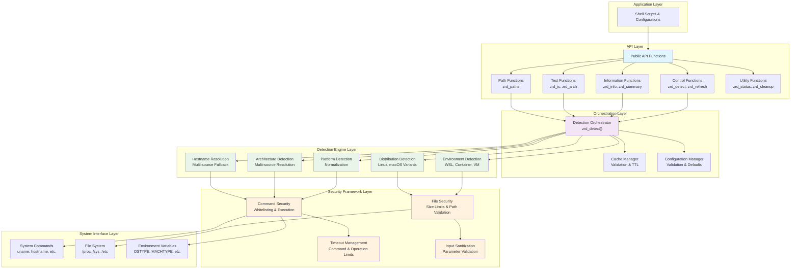
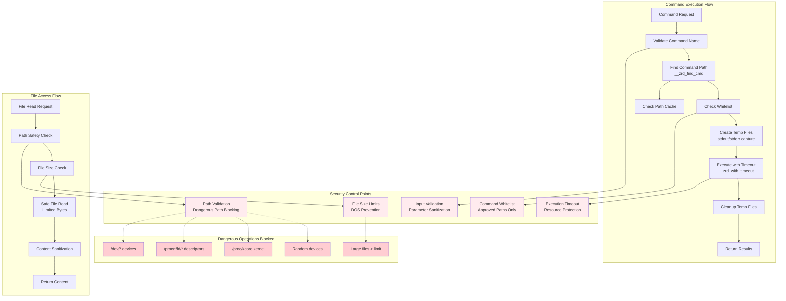
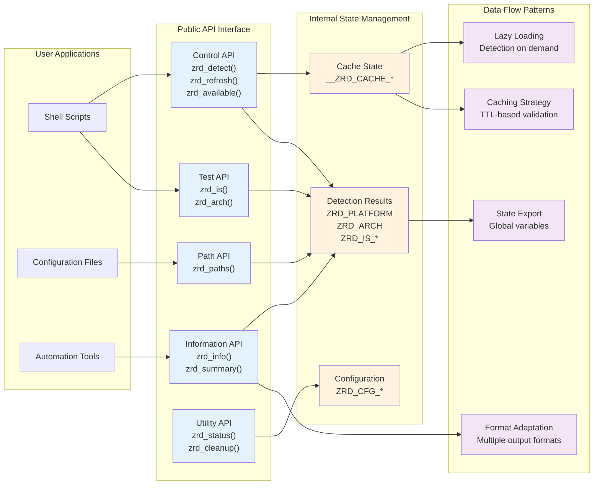

# zsh-runtime-detect: Architectural Documentation

## Table of Contents

1. [Executive Summary](#executive-summary)
2. [System Overview](#system-overview)
3. [Architectural Principles](#architectural-principles)
4. [Component Architecture](#component-architecture)
5. [Security Architecture](#security-architecture)
6. [Detection Flow Architecture](#detection-flow-architecture)
7. [API Architecture](#api-architecture)
8. [Data Architecture](#data-architecture)
9. [Performance Architecture](#performance-architecture)
10. [Quality Attributes](#quality-attributes)
11. [Deployment Architecture](#deployment-architecture)
12. [Future Considerations](#future-considerations)

---

## Executive Summary

**zsh-runtime-detect** is a security-focused, high-performance runtime environment detection library for Zsh shells. It provides comprehensive platform, architecture, and environment detection capabilities with intelligent caching, robust security controls, and enterprise-grade reliability.

### Key Architectural Characteristics

- **Security-First Design**: Command whitelisting, input sanitization, resource limits
- **Performance-Optimized**: Intelligent caching with TTL, lazy loading, efficient fallbacks
- **Fault-Tolerant**: Graceful degradation, multiple detection strategies, comprehensive error handling
- **Modular Architecture**: Layered design with clear separation of concerns
- **Standards-Compliant**: XDG Base Directory specification, POSIX compatibility

### Target Use Cases

- Shell configuration management
- Platform-specific script execution
- Container and virtualization detection
- CI/CD environment adaptation
- Cross-platform development tooling

---

## System Overview

The system implements a layered architecture with five primary layers: API, orchestration, detection engines, security framework, and system interface.



---

## Architectural Principles

The architecture is built on the following core principles:

### 1. Security by Design

- **Principle of Least Privilege**: All system interactions are restricted to predefined whitelisted commands
- **Defense in Depth**: Multiple layers of security controls (input validation, timeouts, file restrictions)
- **Fail Secure**: System defaults to safe operation modes when security controls fail

### 2. Performance First

- **Lazy Evaluation**: Detection runs only when explicitly requested or auto-configured
- **Intelligent Caching**: TTL-based caching with signature validation prevents redundant operations
- **Efficient Fallbacks**: Multiple detection strategies ordered by performance characteristics

### 3. Reliability and Fault Tolerance

- **Graceful Degradation**: System continues to operate with reduced functionality when components fail
- **Multiple Data Sources**: Each detection uses multiple information sources for robustness
- **Comprehensive Error Handling**: All operations include proper error handling and recovery

### 4. Modularity and Extensibility

- **Separation of Concerns**: Clear boundaries between detection, security, caching, and API layers
- **Plugin Architecture**: New detection engines can be added without modifying core components
- **Configuration-Driven**: Behavior can be modified through configuration without code changes

---

## Component Architecture

### API Layer Components

The API layer provides a clean, intuitive interface for shell scripts and applications while abstracting the complexity of the underlying detection systems.

| Component           | Functions                                          | Responsibility                       |
|---------------------|----------------------------------------------------|--------------------------------------|
| **Control API**     | `zrd_detect()`, `zrd_refresh()`, `zrd_available()` | Detection lifecycle management       |
| **Information API** | `zrd_info()`, `zrd_summary()`                      | Data retrieval and formatting        |
| **Test API**        | `zrd_is()`, `zrd_arch()`                           | Boolean condition testing            |
| **Path API**        | `zrd_paths()`                                      | Platform-appropriate path resolution |
| **Utility API**     | `zrd_status()`, `zrd_cleanup()`                    | System management and diagnostics    |

### Orchestration Layer Components

| Component                  | Responsibility                              | Key Functions                                    |
|----------------------------|---------------------------------------------|--------------------------------------------------|
| **Detection Orchestrator** | Coordinates all detection activities        | `zrd_detect()`                                   |
| **Cache Manager**          | TTL-based caching with signature validation | `__zrd_cache_valid()`, `__zrd_cache_signature()` |
| **Configuration Manager**  | Validates and manages runtime configuration | `__zrd_validate_config()`                        |

### Detection Engine Components

| Engine                     | Purpose                                 | Implementation Functions                                              |
|----------------------------|-----------------------------------------|-----------------------------------------------------------------------|
| **Platform Detection**     | OS identification and normalization     | `__zrd_normalize_platform()`                                          |
| **Architecture Detection** | CPU architecture resolution             | `__zrd_normalize_arch()`                                              |
| **Environment Detection**  | Virtualization and container detection  | `__zrd_detect_wsl()`, `__zrd_detect_container()`, `__zrd_detect_vm()` |
| **Distribution Detection** | Linux/macOS distribution identification | `__zrd_detect_linux_distro()`, `__zrd_detect_macos_version()`         |
| **Hostname Resolution**    | Multi-source hostname determination     | `__zrd_hostname()`                                                    |

---

## Security Architecture

The security framework implements defense-in-depth principles with multiple control points and validation layers.



### Security Control Mechanisms

#### Command Whitelisting

- **Purpose**: Prevent execution of arbitrary commands
- **Implementation**: Hardcoded whitelist of approved command paths
- **Coverage**: 15+ system commands with multiple path alternatives
- **Fallback**: Commands fail safely if not whitelisted

#### Resource Protection

- **File Size Limits**: Configurable maximum file read size (default: 8KB)
- **Execution Timeouts**: Configurable command timeout (default: 10s)
- **Memory Protection**: Limited buffer sizes for all operations

#### Path Validation

- **Dangerous Paths Blocked**: `/dev/*`, `/proc/*/fd/*`, `/proc/kcore`, random devices
- **Safe Defaults**: All paths validated before access
- **Length Limits**: Path length restrictions to prevent buffer overflow

#### Input Sanitization

- **Parameter Validation**: All function parameters validated
- **Content Filtering**: Control characters stripped from file content
- **Key Validation**: Configuration keys validated with regex patterns

---

## Detection Flow Architecture

The detection process follows a sophisticated orchestration pattern with multiple fallback strategies and comprehensive state management.

```mermaid
graph TD
    START[zrd_detect Called]
    CACHE_CHECK{Cache Valid?}
    CACHE_HIT[Return Cached Data]

    subgraph "System Information Gathering"
        UNAME[Collect uname Data<br/>__zrd_collect_uname]
        ENV[Gather Environment<br/>OSTYPE, MACHTYPE, etc.]
        USER[Get Username<br/>whoami/env vars]
        HOST[Resolve Hostname<br/>__zrd_hostname]
    end

    subgraph "Platform Detection"
        ZRD_NORM[Normalize Platform<br/>__zrd_normalize_platform]
        ZRD_OSTYPE[Check OSTYPE]
        ZRD_UNAME[Check uname -s]
        ZRD_RESULT[Platform Result]
    end

    subgraph "Architecture Detection"
        ARCH_START[Architecture Detection]
        ARCH_HOSTTYPE[Check HOSTTYPE]
        ARCH_UNAME[Direct uname -m]
        ARCH_MACHTYPE[Parse MACHTYPE]
        ARCH_CPUTYPE[Check CPUTYPE]
        ARCH_NORM[Normalize Architecture<br/>__zrd_normalize_arch]
        ARCH_RESULT[Architecture Result]
    end

    subgraph "Environment Detection"
        ENV_WSL[WSL Detection<br/>__zrd_detect_wsl]
        ENV_CONTAINER[Container Detection<br/>__zrd_detect_container]
        ENV_VM[VM Detection<br/>__zrd_detect_vm]
        ENV_TERMUX[Termux Detection]
        ENV_CHROOT[Chroot Detection]
        ENV_CI[CI/CD Detection]
        ENV_SSH[SSH Detection]
        ENV_ROOT[Root Detection]
    end

    subgraph "Distribution Detection"
        DIST_CHECK{Platform?}
        DIST_LINUX[Linux Distribution<br/>__zrd_detect_linux_distro]
        DIST_MACOS[macOS Version<br/>__zrd_detect_macos_version]
        DIST_OTHER[Other Platform]
    end

    subgraph "State Export"
        EXPORT_CORE[Export Core Variables<br/>ZRD_PLATFORM, ZRD_ARCH]
        EXPORT_SYSTEM[Export System Info<br/>ZRD_KERNEL*, ZRD_HOSTNAME]
        EXPORT_DISTRO[Export Distribution<br/>ZRD_DISTRO*]
        EXPORT_FLAGS[Export Boolean Flags<br/>ZRD_IS_*]
        UPDATE_CACHE[Update Cache<br/>Timestamp & Signature]
    end

    COMPLETE[Detection Complete]

    START --> CACHE_CHECK
    CACHE_CHECK -->|Yes| CACHE_HIT
    CACHE_CHECK -->|No| UNAME

    UNAME --> ENV
    ENV --> USER
    USER --> HOST
    HOST --> ZRD_NORM

    ZRD_NORM --> ZRD_OSTYPE
    ZRD_OSTYPE --> ZRD_UNAME
    ZRD_UNAME --> ZRD_RESULT
    ZRD_RESULT --> ARCH_START

    ARCH_START --> ARCH_HOSTTYPE
    ARCH_HOSTTYPE --> ARCH_UNAME
    ARCH_UNAME --> ARCH_MACHTYPE
    ARCH_MACHTYPE --> ARCH_CPUTYPE
    ARCH_CPUTYPE --> ARCH_NORM
    ARCH_NORM --> ARCH_RESULT
    ARCH_RESULT --> ENV_WSL

    ENV_WSL --> ENV_CONTAINER
    ENV_CONTAINER --> ENV_VM
    ENV_VM --> ENV_TERMUX
    ENV_TERMUX --> ENV_CHROOT
    ENV_CHROOT --> ENV_CI
    ENV_CI --> ENV_SSH
    ENV_SSH --> ENV_ROOT
    ENV_ROOT --> DIST_CHECK

    DIST_CHECK -->|Linux| DIST_LINUX
    DIST_CHECK -->|macOS| DIST_MACOS
    DIST_CHECK -->|Other| DIST_OTHER

    DIST_LINUX --> EXPORT_CORE
    DIST_MACOS --> EXPORT_CORE
    DIST_OTHER --> EXPORT_CORE

    EXPORT_CORE --> EXPORT_SYSTEM
    EXPORT_SYSTEM --> EXPORT_DISTRO
    EXPORT_DISTRO --> EXPORT_FLAGS
    EXPORT_FLAGS --> UPDATE_CACHE
    UPDATE_CACHE --> COMPLETE

    style CACHE_CHECK fill:#e3f2fd
    style ZRD_NORM fill:#e8f5e8
    style ARCH_NORM fill:#e8f5e8
    style ENV_WSL fill:#fff3e0
    style ENV_CONTAINER fill:#fff3e0
    style ENV_VM fill:#fff3e0
    style DIST_LINUX fill:#f3e5f5
    style DIST_MACOS fill:#f3e5f5
    style UPDATE_CACHE fill:#fce4ec
```



### Detection Strategy Patterns

#### Multi-Source Resolution

Each detection category employs multiple information sources for robustness:

**Platform Detection Sources:**

1. `OSTYPE` environment variable (primary)
2. `uname -s` system call (fallback)
3. Kernel identification (tertiary)

**Architecture Detection Sources:**

1. `HOSTTYPE` environment variable
2. Direct `uname -m` execution
3. `MACHTYPE` parsing with dash-separated format handling
4. `CPUTYPE` environment variable (final fallback)

**Environment Detection Methods:**

- **WSL**: Environment variables, `/proc/version` content, Windows mount detection
- **Container**: Control groups, mount info, systemd container detection
- **VM**: DMI information, hypervisor flags, hardware profiles

#### Fallback Hierarchies

The system implements graceful degradation patterns:

1. **Command Execution**: Whitelisted → Direct call → Safe failure
2. **File Reading**: `head` → `dd` → Pure zsh → Safe default
3. **Information Sources**: Primary → Secondary → Tertiary → Known defaults

### Cache Management Strategy

#### Cache Validation Logic

```
Cache Valid = (
    TTL Not Expired AND
    Environment Signature Matches AND
    Module Version Matches
)
```

#### Cache Signature Components

- `OSTYPE`, `MACHTYPE`, `HOSTTYPE` environment variables
- User and process IDs (`EUID`, `UID`)
- Module version for compatibility

#### Performance Optimization

- **Early Return**: Valid cache bypasses all detection logic
- **Signature Check**: Lightweight validation before expensive operations
- **TTL Management**: Configurable cache lifetime (default: 300s)

---

## API Architecture

The API layer implements clean separation between public interfaces and internal implementation details, with multiple usage patterns supported.



### API Design Patterns

#### Function Naming Convention

- **Prefix**: All public functions use `zrd_` prefix
- **Internal**: All internal functions use `__zrd_` prefix with double underscore
- **Categorization**: Functions grouped by purpose (detect, info, test, etc.)

#### Parameter Patterns

- **Optional Parameters**: Most functions accept optional parameters with sensible defaults
- **Type Safety**: Parameter validation at function entry points
- **Flexibility**: Multiple output formats and query types

#### State Management

- **Global Variables**: Detection results stored in global `ZRD_*` variables
- **Boolean Flags**: Consistent `ZRD_IS_*` pattern for boolean conditions
- **Namespace Protection**: All variables prefixed to avoid conflicts

### Usage Patterns

#### Conditional Logic Pattern

```bash
if zrd_is macos; then
    # macOS-specific logic
elif zrd_is linux; then
    # Linux-specific logic
fi
```

#### Information Retrieval Pattern

```bash
platform_info=$(zrd_info extended)
config_dir=$(zrd_paths config)
arch_bits=$(zrd_arch bits)
```

#### JSON Integration Pattern

```bash
zrd_info json | jq -r '.platform + "/" + .architecture'
```

#### Performance Pattern

```bash
# Lazy loading - detection runs only when needed
zrd_available || zrd_detect
echo "Platform: $(zrd_summary)"
```

---

## Data Architecture

### State Variables Taxonomy

#### Core System Information

| Variable             | Type   | Purpose                  | Example Values               |
|----------------------|--------|--------------------------|------------------------------|
| `ZRD_PLATFORM`       | String | Normalized platform name | `darwin`, `linux`, `freebsd` |
| `ZRD_ARCH`           | String | Normalized architecture  | `x86_64`, `aarch64`, `arm`   |
| `ZRD_KERNEL`         | String | Kernel name              | `Darwin`, `Linux`            |
| `ZRD_KERNEL_RELEASE` | String | Kernel version           | `23.1.0`, `5.15.0`           |
| `ZRD_HOSTNAME`       | String | System hostname          | `macbook-pro`, `server-01`   |
| `ZRD_USERNAME`       | String | Current user             | `user`, `admin`              |

#### Distribution Information

| Variable              | Type   | Purpose               | Example Values              |
|-----------------------|--------|-----------------------|-----------------------------|
| `ZRD_DISTRO`          | String | Distribution name     | `ubuntu`, `macos`, `centos` |
| `ZRD_DISTRO_VERSION`  | String | Distribution version  | `22.04`, `14.1`, `8`        |
| `ZRD_DISTRO_CODENAME` | String | Distribution codename | `jammy`, `Sonoma`, `Stream` |

#### Boolean Detection Flags

| Variable           | Type    | Purpose                  | True Condition              |
|--------------------|---------|--------------------------|-----------------------------|
| `ZRD_IS_MACOS`     | Integer | macOS detection          | Platform is Darwin          |
| `ZRD_IS_LINUX`     | Integer | Linux detection          | Platform is Linux           |
| `ZRD_IS_BSD`       | Integer | BSD detection            | FreeBSD, OpenBSD, NetBSD    |
| `ZRD_IS_WSL`       | Integer | WSL detection            | Windows Subsystem for Linux |
| `ZRD_IS_CONTAINER` | Integer | Container detection      | Docker, Podman, LXC         |
| `ZRD_IS_VM`        | Integer | VM detection             | VMware, VirtualBox, QEMU    |
| `ZRD_IS_ARM`       | Integer | ARM architecture         | ARM or AArch64              |
| `ZRD_IS_X86_64`    | Integer | x86_64 architecture      | 64-bit x86                  |
| `ZRD_IS_ROOT`      | Integer | Administrator privileges | EUID = 0                    |
| `ZRD_IS_SSH`       | Integer | SSH session              | SSH environment detected    |

### Configuration Schema

#### User Configuration Variables

| Variable                | Type    | Range      | Default | Purpose                    |
|-------------------------|---------|------------|---------|----------------------------|
| `ZRD_CFG_AUTO_DETECT`   | Integer | 0-1        | 0       | Auto-run detection on load |
| `ZRD_CFG_DEBUG`         | Integer | 0-3        | 0       | Debug logging level        |
| `ZRD_CFG_CACHE_TTL`     | Integer | 60-3600    | 300     | Cache timeout seconds      |
| `ZRD_CFG_MAX_FILE_SIZE` | Integer | 1024-65536 | 8192    | Max file read bytes        |
| `ZRD_CFG_CMD_TIMEOUT`   | Integer | 0-60       | 10      | Command timeout seconds    |

#### Internal State Variables

| Variable                | Type              | Purpose                   |
|-------------------------|-------------------|---------------------------|
| `__ZRD_CACHE_DETECTED`  | Integer           | Detection completion flag |
| `__ZRD_CACHE_TIME`      | Integer           | Last detection timestamp  |
| `__ZRD_CACHE_SIGNATURE` | String            | Environment signature     |
| `__ZRD_CMD_PATH_CACHE`  | Associative Array | Command path cache        |

### Data Flow Patterns

#### Input → Processing → Output Flow

1. **Input**: System calls, file reads, environment variables
2. **Processing**: Normalization, validation, comparison
3. **Output**: Global variables, function returns, formatted output

#### Cache Invalidation Strategy

- **Time-based**: TTL expiration triggers refresh
- **Signature-based**: Environment change detection
- **Version-based**: Module version compatibility check

---

## Performance Architecture

### Performance Design Principles

#### Lazy Evaluation Strategy

- **On-Demand Detection**: System information gathering occurs only when explicitly requested
- **Auto-Detection Control**: Configurable automatic detection via `ZRD_CFG_AUTO_DETECT`
- **API-Driven**: Functions like `zrd_available()` check state before triggering detection

#### Caching Architecture

- **Multi-Level Validation**: TTL, signature, and version-based cache validation
- **Command Path Caching**: Frequently used command paths cached to avoid repeated filesystem lookups
- **Early Returns**: Valid cache bypasses all detection logic for maximum performance

#### Efficient Fallback Chains

- **Ordered by Performance**: Primary methods chosen for speed, fallbacks for reliability
- **Minimal System Calls**: Environment variables checked before executing system commands
- **Resource Limits**: Configurable timeouts and file size limits prevent performance degradation

### Performance Characteristics

#### Execution Time Profiles

| Operation            | Cold Run | Warm Run (Cached) | Factors                |
|----------------------|----------|-------------------|------------------------|
| **First Detection**  | 50-200ms | N/A               | System calls, file I/O |
| **Cached Detection** | <1ms     | <1ms              | Cache validation only  |
| **API Queries**      | <1ms     | <1ms              | Variable access        |
| **JSON Output**      | 1-5ms    | 1-5ms             | String formatting      |

#### Memory Footprint

| Component                | Memory Usage | Notes                        |
|--------------------------|--------------|------------------------------|
| **Global Variables**     | ~2KB         | Detection results            |
| **Function Definitions** | ~15KB        | All public/private functions |
| **Command Cache**        | ~1KB         | Cached command paths         |
| **Total Runtime**        | ~18KB        | Typical loaded state         |

#### Resource Utilization Limits

- **File Read Limit**: 8KB default (configurable: 1KB-64KB)
- **Command Timeout**: 10s default (configurable: 0-60s)
- **Cache TTL**: 300s default (configurable: 60-3600s)

---

## Quality Attributes

### Security Qualities

#### Threat Model Coverage

| Threat                     | Mitigation           | Implementation               |
|----------------------------|----------------------|------------------------------|
| **Command Injection**      | Whitelist validation | `__ZRD_WHITELIST_CMDS` array |
| **Path Traversal**         | Path sanitization    | Dangerous path blocking      |
| **Resource Exhaustion**    | Size/timeout limits  | Configurable limits          |
| **Privilege Escalation**   | Least privilege      | No setuid operations         |
| **Information Disclosure** | Safe defaults        | Fail-secure patterns         |

#### Security Controls Effectiveness

- **Command Whitelisting**: 100% coverage of system command execution
- **Input Validation**: All user inputs and file contents validated
- **Resource Limits**: DOS protection via configurable boundaries
- **Error Handling**: No sensitive information in error messages

### Reliability Qualities

#### Fault Tolerance Patterns

- **Graceful Degradation**: System continues with reduced functionality when components fail
- **Multiple Data Sources**: Each detection uses 2-4 information sources
- **Safe Defaults**: Unknown values default to safe, identifiable strings
- **Error Isolation**: Component failures don't cascade to other components

#### Availability Characteristics

- **Zero External Dependencies**: No network calls or external service dependencies
- **Offline Operation**: Full functionality without internet connectivity
- **Platform Independence**: Core functionality works across all supported platforms

#### Recovery Mechanisms

- **Cache Invalidation**: Automatic cache refresh on environment changes
- **State Reset**: `zrd_cleanup()` provides complete module reset capability
- **Version Handling**: Automatic reload on version mismatches

### Maintainability Qualities

#### Code Organization

- **Modular Design**: Clear separation between API, detection, and security layers
- **Consistent Naming**: Systematic function and variable naming conventions
- **Comprehensive Documentation**: Inline documentation for all functions

#### Extensibility Points

- **Detection Engines**: New platform/environment detection can be added
- **Output Formats**: New information formats can be implemented
- **Security Controls**: Additional validation layers can be inserted

#### Testing Strategies

- **Unit Testing**: Individual detection functions can be tested in isolation
- **Integration Testing**: Full detection workflow validation
- **Platform Testing**: Cross-platform compatibility validation

---

## Deployment Architecture

### Installation Patterns

#### Single File Deployment

- **Self-Contained**: All functionality in single `zrd.zsh` file
- **No Installation**: Simple source operation in shell scripts
- **Version Management**: Built-in version detection and cleanup

#### Integration Methods

##### Shell Configuration Integration

```bash
# .zshrc integration
source /path/to/zrd.zsh
ZRD_CFG_AUTO_DETECT=1  # Optional: auto-detect on load
```

##### Script Integration

```bash
#!/usr/bin/env zsh
source "$(dirname "$0")/zrd.zsh"
zrd_detect

if zrd_is macos; then
    # macOS-specific logic
fi
```

##### Conditional Loading

```bash
# Load only if available
if [[ -r "$HOME/.local/lib/zrd.zsh" ]]; then
    source "$HOME/.local/lib/zrd.zsh"
    zrd_detect
fi
```

### Configuration Management

#### Environment Variables

| Variable              | Deployment Impact        | Recommendations                 |
|-----------------------|--------------------------|---------------------------------|
| `ZRD_CFG_AUTO_DETECT` | Performance              | Set to 1 for interactive shells |
| `ZRD_CFG_DEBUG`       | Troubleshooting          | Set to 2-3 for development      |
| `ZRD_CFG_CACHE_TTL`   | Performance vs. Accuracy | Longer for stable environments  |

#### Runtime Configuration

- **Development**: Higher debug levels, shorter cache TTL
- **Production**: Minimal debug, longer cache TTL, auto-detect enabled
- **CI/CD**: Minimal debug, cache disabled, specific timeouts

### Platform-Specific Considerations

#### macOS Deployment

- **Homebrew Integration**: Compatible with Homebrew-installed tools
- **Xcode Command Line Tools**: Graceful handling of missing tools
- **Apple Silicon**: Native ARM64 detection and optimization

#### Linux Deployment

- **Distribution Agnostic**: Works across all major Linux distributions
- **Container Environments**: Full container and orchestration platform detection
- **Minimal Systems**: Functions with limited command availability

#### BSD Deployment

- **FreeBSD, OpenBSD, NetBSD**: Native support for all major BSD variants
- **Package Managers**: Compatible with pkg, ports, and pkgsrc

---

## Future Considerations

### Architectural Evolution

#### Extensibility Roadmap

1. **Plugin Architecture**: Modular detection engines for new environments
2. **Configuration Files**: YAML/TOML configuration support
3. **Async Detection**: Background detection for improved shell startup times

#### Technology Considerations

- **Cross-Shell Support**: Potential bash/fish compatibility layer
- **Binary Compilation**: Compiled detection for performance-critical environments
- **Remote Detection**: Capability for remote system detection

### Scalability Patterns

#### Enterprise Integration

- **Centralized Configuration**: Shared configuration management
- **Audit Logging**: Detailed detection logging for compliance
- **Policy Enforcement**: Centralized security policy application

#### Performance Optimization

- **Parallel Detection**: Concurrent detection engine execution
- **Incremental Updates**: Partial cache updates for changed components
- **Memory Optimization**: Reduced memory footprint for embedded systems

### Maintenance Strategy

#### Backward Compatibility

- **API Versioning**: Semantic versioning for API compatibility
- **Migration Tools**: Automated migration between major versions
- **Deprecation Policy**: Clear deprecation timelines for changes

#### Community Contribution

- **Testing Framework**: Comprehensive test suite for community contributions
- **Documentation Standards**: Clear contribution guidelines
- **Platform Support**: Community-driven platform detection additions

